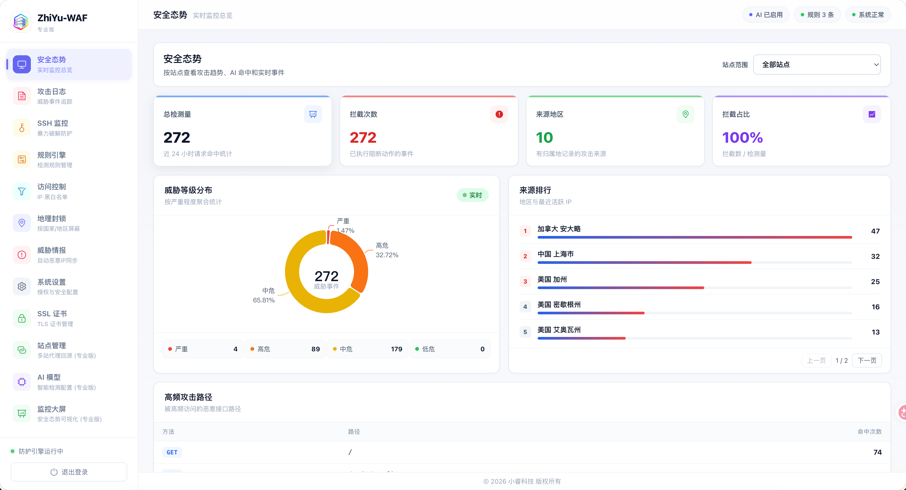
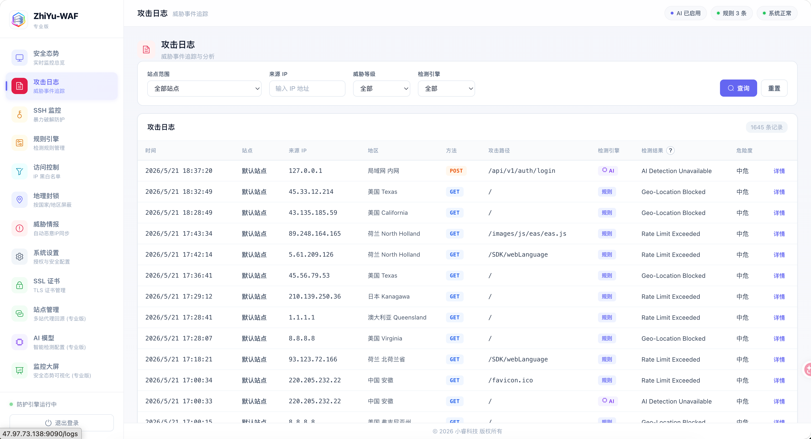
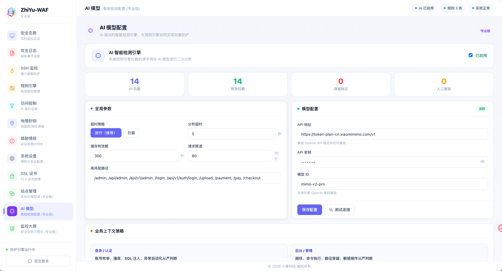
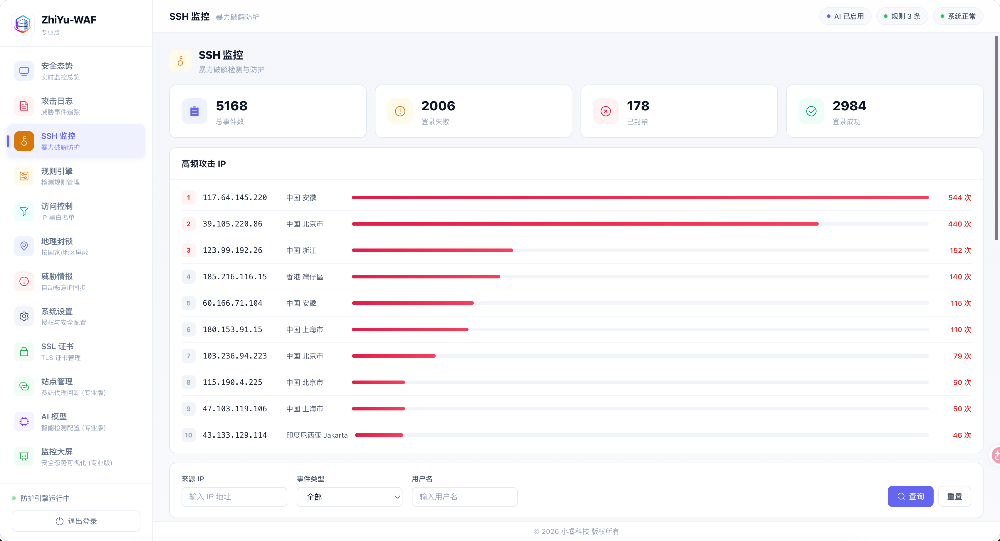
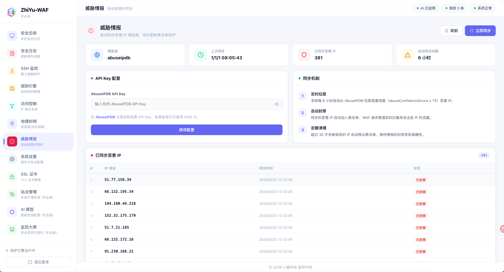
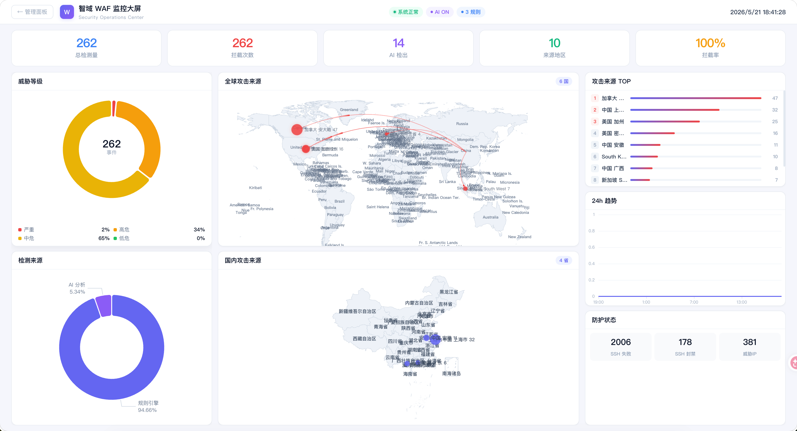

<div align="center">


<br>

# 智域 WAF

**AI 驱动的新一代 Web 应用防火墙**

轻量 · 高性能 · 开箱即用 — 为中小企业和开发者打造

<br>


<br><br>

[核心特性](#-核心特性) · [界面预览](#-界面预览) · [快速开始](#-快速开始) · [功能对比](#-功能对比) · [部署指南](#-部署指南)

</div>

<br>

---

##   核心特性

<table>
<tr>
<td width="50%">

###   AI 智能检测
接入 OpenAI / Claude / 自定义模型，对请求进行语义级分析，自动学习攻击模式

- 异步检测，不阻塞业务请求
- 5s 超时 + fail-open 保底机制
- 内置熔断器，AI 异常自动降级

</td>
<td width="50%">

###  ️ 规则引擎
覆盖 SQL 注入、XSS、命令注入、路径穿越等 OWASP Top 10 攻击

- 正则 + 模式匹配双引擎
- 支持自定义规则，热加载生效
- Log4j / Spring4Shell / Struts2 等高危漏洞

</td>
</tr>
<tr>
<td width="50%">

###   地理封锁
基于 ISO 3166-1 国家代码精准匹配，按地区批量封锁

- 200+ 国家/地区支持
- 中文国名自动解析
- 实时生效，无需重启

</td>
<td width="50%">

###   SSH 防护
实时监控 SSH 登录日志，自动封禁暴力破解 IP

- 可配置最大失败次数
- 自定义封禁时长
- 封禁记录可追溯

</td>
</tr>
<tr>
<td width="50%">

###   威胁情报
集成多源威胁情报，自动同步恶意 IP 黑名单

- 支持自定义情报源
- 定时自动同步
- 与防护引擎联动

</td>
<td width="50%">

###   SSL/TLS 管理
ACME 自动签发 Let's Encrypt 证书，到期自动续期

- 零配置 HTTPS
- HTTP/2 自动协商
- 自定义证书部署

</td>
</tr>
</table>

---

##   界面预览

<table>
<tr>
<td width="50%"></td>
<td width="50%"></td>
</tr>
<tr>
<td width="50%"></td>
<td width="50%"></td>
</tr>
<tr>
<td width="50%"></td>
<td width="50%"></td>
</tr>
</table>



---

## ⚡ 快速开始

### Docker 一键部署

```bash
docker compose up -d
```

访问管理面板：`http://your-server:9090`

### 二进制部署

```bash
git clone https://github.com/JayLee-sre/ZHIYU-WAF.git
cd ZhiYu-WAF

# 构建前端
cd web && npm install && npm run build && cd ..

# 构建后端
CGO_ENABLED=1 go build -o bin/zhiyu-waf ./cmd/zhiyu-waf

# 启动（需 root 权限以使用 iptables）
sudo ./bin/zhiyu-waf -config configs/zhiyu-waf.yaml
```

### 一键安装脚本

```bash
sudo bash scripts/install-zhiyu-waf.sh --backend 127.0.0.1:3000 --public-port 80
```

---

##   功能对比

<table>
<tr>
<th width="40%">功能</th>
<th width="30%" align="center">社区版</th>
<th width="30%" align="center">专业版</th>
</tr>
<tr><td>规则引擎（SQLi / XSS / CMDi 等）</td><td align="center">✅</td><td align="center">✅</td></tr>
<tr><td>速率限制</td><td align="center">✅</td><td align="center">✅</td></tr>
<tr><td>SSL/TLS 自动证书</td><td align="center">✅</td><td align="center">✅</td></tr>
<tr><td>管理仪表盘</td><td align="center">✅</td><td align="center">✅</td></tr>
<tr><td>SSH 暴力破解防护</td><td align="center">✅</td><td align="center">✅</td></tr>
<tr><td>实时日志流</td><td align="center">✅</td><td align="center">✅</td></tr>
<tr><td>备份与恢复</td><td align="center">✅</td><td align="center">✅</td></tr>
<tr><td>AI 智能检测</td><td align="center">基础</td><td align="center">✅ 高级</td></tr>
<tr><td>地理封锁</td><td align="center">❌</td><td align="center">✅</td></tr>
<tr><td>威胁情报同步</td><td align="center">❌</td><td align="center">✅</td></tr>
<tr><td>AI 建议规则生成</td><td align="center">❌</td><td align="center">✅</td></tr>
<tr><td>多站点管理</td><td align="center">❌</td><td align="center">✅</td></tr>
<tr><td>高级威胁画像分析</td><td align="center">❌</td><td align="center">✅</td></tr>
<tr><td>多用户 + RBAC</td><td align="center">❌</td><td align="center">✅</td></tr>
<tr><td>优先技术支持</td><td align="center">❌</td><td align="center">✅</td></tr>
</table>

---

##   系统架构

```
                        ┌───────────┐
                        │  Client   │
                        └─────┬─────┘
                              │
                   ┌──────────▼──────────┐
                   │  iptables REDIRECT   │
                   │    (80 → 8080)       │
                   └──────────┬──────────┘
                              │
            ┌─────────────────▼─────────────────┐
            │         ZhiYu-WAF Proxy            │
            │                                     │
            │   Stage 1 · Rate Limit              │
            │   Stage 2 · Rule Engine             │
            │   Stage 3 · Geo Check               │
            │   Stage 4 · Threat Intelligence     │
            │   Stage 5 · AI Analysis             │
            │                                     │
            │   ┌──────────┐  ┌──────────────┐    │
            │   │  Action   │  │  Log/Alert   │    │
            │   └──────────┘  └──────────────┘    │
            └─────────────────┬─────────────────┘
                              │
                   ┌──────────▼──────────┐
                   │   Backend Server    │
                   └─────────────────────┘

            ┌────────────────────────────────┐
            │     Dashboard (:9090)           │
            │   Vue 3 + WebSocket + REST API  │
            └────────────────────────────────┘
```

---

##   部署指南

### 环境要求

| 依赖 | 说明 |
|------|------|
| **Go** ≥ 1.21 | 后端编译 |
| **Node.js** ≥ 18 | 前端构建 |
| **iptables** | Linux 透明代理 |
| **gcc** | CGO/sqlite 支持 |

### 端口说明

| 端口 | 用途 |
|------|------|
| `80` | 业务入口，iptables 自动转发到 WAF |
| `8080` | WAF 代理监听 |
| `9090` | 管理面板 + API |
| `443` | HTTPS（启用 ACME 后自动开放） |

### Docker 部署

```bash
# 开发环境
docker compose up -d

# 生产环境
docker run -d \
  --name zhiyu-waf \
  --cap-add NET_ADMIN \
  --network host \
  -v /your/configs:/opt/zhiyu-waf/configs:ro \
  -v waf-data:/opt/zhiyu-waf/data \
  zhiyu-waf:latest
```

---

## ⚙️ 配置说明

核心配置文件：`configs/zhiyu-waf.yaml`

```yaml
proxy:
  listen_addr: ":8080"
  backend_addr: "127.0.0.1:80"
  iptables_enable: true

dashboard:
  listen_addr: ":9090"
  jwt_secret: "change-me"     # 务必修改

ai:
  enabled: true
  provider: "openai"
  async_timeout: 5
  fail_open: true
  providers:
    openai:
      api_key: "sk-your-key"
      model: "gpt-4o"
      base_url: "https://api.openai.com/v1"

ssh:
  enabled: true
  max_fails: 5
  ban_minutes: 30
```

---

##   开发

```bash
make run              # 后端开发
cd web && npm run dev # 前端热更新
make test             # 运行测试
make bench            # 性能基准测试
```

---

##   开源协议

本项目采用 [AGPL-3.0](LICENSE) 开源。

你可以自由使用、修改和分发，但修改后的代码或通过网络提供服务时，**必须同样开源**。

---

<div align="center">

**如果这个项目对你有帮助，请给一个 ⭐ Star 支持我们！**

<br>

[](https://star-history.com/#JayLee-sre/ZHIYU-WAF&Date)

<br>

Made with ❤️ by 小睿科技

</div>
